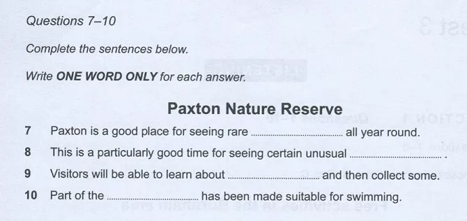
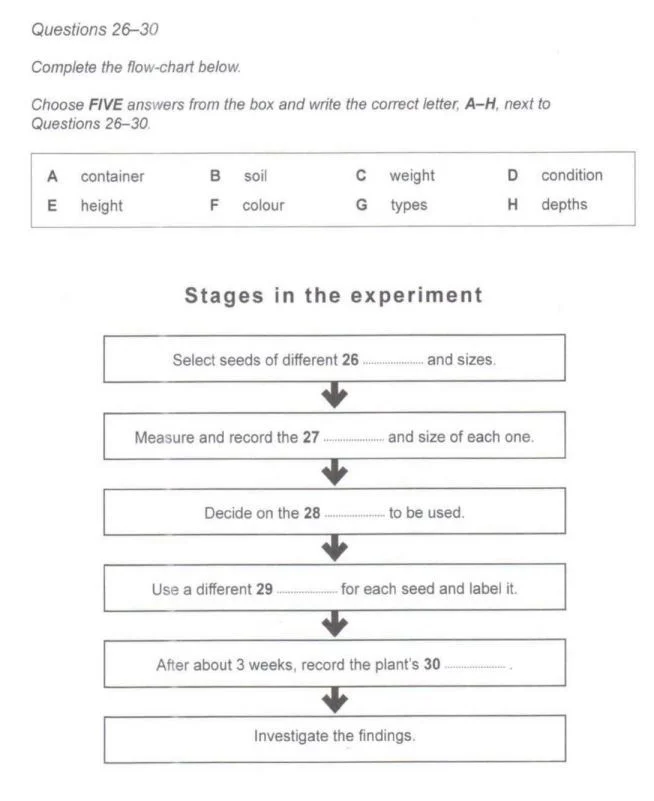

This is an explaination of all schemas and models.

In ielts exam there are a limited types of questions that can be asked. for eg:
- Listening
  - Multiple Choice Questions ( Type 1 and 2 )
  - Matching ( Matching List and Matching Info )
  - Diagram Completion
  - Plan/Map Labelling
  - Sentence Completion
  - Note Completion
  - Flow Chat Completion
  - Table Completion
  - Summary Completion
  - Form Completion


- Reading
  - Multiple Choice Questions ( Type 1 and 2 )
  - True/False/Not Given
  - Yes/No/Not Given
  - Matching ( Matching List and Matching Info )
  - Sentence Completion
  - Note Completion
  - Flow Chat Completion
  - Table Completion
  - Diagram Completion
  - Summary Completion
  - Short Answer Questions


Listening schema explainations:

1. Matching : 
   1. Type 1 example:

        

        for this the json will be :
        ```
        const q = {
            startQuestionNum : 21,
            endQuestionNum : 25,
            numOfWords: 1,
            numOfNum: 0,
            questionHeader : 'Write the correct letter, A, B or C next to question 21-25.\nYou may choose any letter more than once.',
            questionOptionRepeatable : true,
            questionStatment : 'What does Jack tell his tutor about each of the following course option?',
            questionOptions : ['
            A He'll definitely do it.', 
            'B He may or may not do it.',
            'C He won't do it.'],
            numStatements : [
                '21 Media Studies _BLANK_',
                '22 Women and Power _BLANK_',
                '23 Culture and Society _BLANK_',
                '24 Identify and Popular Culture _BLANK_',
                '25 Introduction to Culture Theory _BLANK_',
            ],
        }
        ```
   2. Type 2 example:

        

        for this the json will be:
        ```
        const q = {
            startQuestionNum: 1,
            endQuestionNum: 4,
            numOfWords: 1,
            numOfNum: 0,
            questionHeader: 'Choose your answers from the box and write the correct letter A-E next to questions 1-4.',
            questionOptionRepeatable: false,
            questionStatment: 'Which hotel matches each description?',
            questionOptions: [
                'A The Bridge Hotel',
                'B Carlton House',
                'C The Imperial',
                'D The Majestic',
                'E The Royal Oak'
            ],
            numStatements: [
                '1 is in a rural area _BLANK_',
                '2 only opened recently _BLANK_',
                '3 offers facilities for business functions _BLANK_',
                '4 has an indoor swimming pool _BLANK_',
            ]
        }
        ``` 


2. Sentence Completion: 
    
    example 1:

   

    for this json will be:
    ```
    const q = {
        startQuestionNum: 9,
        endQuestionNum: 10,
        numOfWords: 3,
        numOfNum: 0,
        questionHeader: 'Write NO MORE THAN THREE WORDS to complete each space.' ,
        numStatements: [
            '9 Samuel's aunt plans to travel to his apartment on _BLANK_.',
            '10 The journey time is approximately _BLANK_.'
        ] 
    }
    ```

    example 2:

    

    for this json will be:
    ```
    const q = {
        startQuestionNum: 7,
        endQuestionNum: 10,
        numOfWords: 1,
        numOfNum: 0,
        questionHeader: 'Complete the sentences below.\nWrite ONE WORD ONLY for each answer.\n\tPaxton Nature Reserve' ,
        numStatements: [
            '7 Paxton is a good place for seeing rare _BLANK_ all year round.',
            '8 This is a particularly good time for seeing certain unusual _BLANK_.',
            '9 Visitors will be able to learn about _BLANK_ and then collect some.',
            '10 Part of the _BLANK_ has been made suitable for swimming.'
        ] 
    }
    ```

    `numOfNum` property is for cases like this: 

    

    so json will be:
    ```
    const q = {
        ...
        numOfWords: 1,
        numOfNum: 1,
        ...
    }
    ```


3. Multiple Choice question:


    There are two types of multiple question:
    - type 1 (single answer)
    - type 2 (multiple answer)

    Type 1 eg:

    

    for this json will be:
    ```
    const q = {
        startQuestionNum: 15,
        endQuestionNum: 17,
        numOfWords: 1,
        numOfNum: 0,
        qType: 1
        questionHeader: ['Choose the correct letter, A, B or C.'],
        numStatements:[
            '15 How does BC Travel plan to expand the painting holidays?',
            '16 Why are BC Travel's cooking holidays unusual?',
            '17 What does the speaker say about the photography holidays?'
        ],
        questionStatements: [
            [
                'A by adding to the number of locations',
                'B by increasing the range of levels',
                'C by employing more teachers'
            ],
            [
                'A They only use organic foods',
                'B They have an international focus',
                'C They mainly involve vegetarian dishes'
            ],
            [
                'A Clients receive individual tution.',
                'B The tutors are also trained guides.',
                'C Advice is given on selling photographs.'
            ],
        ]
    };
    ```

    Type 2 eg:

    

    for this json will be:
    ```
    const q = {
        startQuestionNum: 11,
        endQuestionNum: 14,
        numOfWords: 1,
        numOfNum: 0,
        qType: 2
        questionHeader: ['Choose TWO letter, A-E','Choose TWO letter, A-E'],
        numStatements:['Which TWO age groups are taking increasing numbers of holiday with BC Travel?','Which TWO are the main reasons given for the popularity of activity holidays?'],
        questionOptions: [
            [
                'A 16-30 years', 
                'B 31-42 years', 
                'C 43-54 years', 
                'D 55-64 years', 
                'E over 65 years'
            ],
            [
                'A Clients make new friends.', 
                'B Clients learn a useful skill.', 
                'C Clients learn about a different culture.', 
                'D Clients are excited by the risk involved.', 
                'E Clients find them value for money.'
            ]
        ]
    };
    ```


4. Summary Completion:
    
    In summary completion of listening test there will only be Type 1 questions asked. 
    
    Refer to Reading Summary Completion for Type 1 schema explaination.

5. Note Completion:
   
   This is similar to type 1 summary completion with subtle differences.

    

    for this json will be:
    ```
    const q = {
        startQuestionNum: 11,
        endQuestionNum: 16,
        numOfWords: 3,
        numOfNum: 1,
        questionHeader: 'Complete the notes below.\nWrite NO MORE THAN THREE WORDS AND/OR A NUMBER for each answer.',
        questionTitle: 'The National Arts Centre',
        questionStatements: 
        [
            'Well known for:\t11 _BLANK_.',
            'Complex consists of:\tconcert rooms\ntheatres\ncinemas\nart galleries\npublic library\nrestaurants\n12 _BLANK_',
            'Historical background:\t1940 area dostoyed by bombs\n19605 — Centre was 13 _BLANK_\nIn 14 _BLANK_ opened to public',
            'Managed by:\t15 _BLANK_',
            'Open:\t16 _BLANK_ days per year'
        ],

    }
    ```

6. Diagram Completion:
   
   In this type of question there will be an image with options given. You have to listening and label the appropriate question statement with a label from option.

   

   for this json will be:
   ```
    const q = {
        startQuestionNum: 14,
        endQuestionNum: 20,
        options: true,
        questionHeader: 'Label the map below.\nWrite the correct letter, A-I, next to Questions 14-20',
        questionTitle: 'Proposed traffic changes in Granford',
        image: {
            data: buffer,
            contentType: 'image/png'
        },
        questionOptions: [
            'A',
            'B',
            'C',
            'D',
            'E',
            'F',
            'G',
            'H',
            'I'
        ],
        numStatements: [
            '14 New traffic lights _BLANK_',
            '15 Pedestrain crossing _BLANK_',
            '16 Parking allowed _BLANK_'
            '17 New 'No Parking' sign _BLANK_'
            '18 New disabled parking spaces _BLANK_',
            '19 Widened pavement _BLANK_',
            '20 Lorry loading/unloading restrictions _BLANK_'
        ]
    }
   ```
   

   

   for this json will be:
   ```
    const q = {
        startQuestionNum: 11,
        endQuestionNum: 15,
        qType: 1,
        image: {
            data: buffer,
            contentType: 'image/png'
        },
        questionOptions: [
            'A Art collection',
            'B Children’s books',
            'C Computers',
            'D Local history collection',
            'E Meeting room',
            'F Multimedia',
            'G Periodicals',
            'H Reference books',
            'I Tourist information',
        ],
        numStatements: [
            '11 _BLANK_',
            '12 _BLANK_',
            '13 _BLANK_'
            '14 _BLANK_'
            '15 _BLANK_',
        ]
    }
   ```


7. Flowchart Completion:
   
   In this type of question there will be a flow chart. There will be blanks in the flow chart where you have to fill in the appropriate word through listening to audio or there might be options given to and you have to pick a synonym to the word in audio to fill. 

   

   for this json will be:
   ```
    const q = {
        startQuestionNum: 31,
        endQuestionNum: 34,
        numOfWords: 2,
        numOfNum: 2,
        questionHeader: 'You will hear an extract from a university lecture on the topic of economics.\nFirst, look at questions 31 to 34. Now listen carefully and answer questions 31-34.\nQuestions 31-34. Do not write MORE THAN TWO WORDS AND/OR NUMBERS. Complete the chart below.',
        steps: [
            [
                'Effects of 2020 Pandemic'
            ],
            [
                '31 _BLANK_ changed'
            ],
            [
                ' Demand for 32 _BLANK_ in stores increased'
            ],
            [
                'Prices increased by more than 2%'
            ],
            [
                '33 _BLANK_ went up by 2.4%',
                'Protein went up by 34 _BLANK_'
            ]
        ]
    }
   ```

   

   ```
    const q = {
        startQuestionNum: 26,
        endQuestionNum: 30,
        numOfWords: 1,
        numOfNum: 0,
        questionHeader: 'Complete the flowchart below.\nChoose FIVE answers from the box and write the correct letter, A-H, next to Questions 26-30.',
        questionOptions: [
            'A container',
            'B soil',
            'C weight',
            'D condition',
            'E height',
            'F colour',
            'G types',
            'H depths',
        ],
        questionTitle: 'Stages in the experiment',
        steps: [
            [
                'Select seeds of different 26 _BLANK_ and sizes.'
            ],
            [
                'Measure and record the 27 _BLANK_ and size of each one.'
            ],
            [
                'Decide on the 28 _BLANK_ to be used.'
            ],
            [
                'Use a different 29 _BLANK_ for each seed and label it.'
            ],
            [
                'After about 3 weeks, record the plant's 30 _BLANK_'
            ],
            [
                'Investigate the findings.'
            ],
        ],
    }
   ```

8. Table Completion: 
   
   In this question there is a table filled with data and there are blanks you have to use audio info or passage info. (same schema as listening table completion)

   

   for this json will be:
   ```
    const q = {
        startQuestionNum: 6,
        endQuestionNum: 10,
        numOfWords: 1,
        numOfNum: 1,
        noOfRows: 7,
        noOfCols: 3,
        rows: [
            [
                'TRANSPORT',
                'CASH FARE',
                'CARD FARE',
            ],
            [
                'Bus',
                '6 $ _BLANK_',
                '$1.50',
            ],
            [
                'Train (peak)',
                '$10',
                '$10',
            ],
            [
                'Train (off-peak)- before 5pm or after 7 _BLANK_ pm',
                '$10',
                '8 $ _BLANK_',
            ],
            [
                '9 _BLANK_ ferry',
                '$4.50',
                '$3.55',
            ],
            [
                'Tourist ferry 10 _BLANK_',
                '$35',
                '-',
            ],
            [
                'Tourist ferry (whole day)',
                '$65',
                '-',
            ]
        ],
    }
   ```

9. Form Completion:
    
    In this question there is a form with blanks in it and you have to use audio info to fill it in.

    

    for this the json will be:
    ```
    const q = {
        startQuestionNum: 1,
        endQuestionNum: 8,
        numOfWords: 3,
        numOfNum: 1,
        questionHeader: 'Questions 1-8\n
        Complete the form below.\nWrite NO MORE THAN THREE WORDS AND/OR A NUMBER for each answer.',
        questionTitle: 'PACKHAM'S SHIPPING AGENCY - customer quotation form',
        questionStatements: [
            'Name:\tJacob 1 _BLANK_',
            'Address to be collected from:\t2 _BLANK_ College, Downlands Rd',
            'Town:\tBristol',
            'Postcode:\t3 _BLANK_',
            'Size of container:',
            'length: 1.5m',
            'width: 4 _BLANK_',
            'height: 5 _BLANK_',
            'Contents:',
            'clothes',
            '6 _BLANK_',
            '7 _BLANK_',
            'Total estimated value: 8 £ _BLANK_',
        ]
    }
    ```

10. Short Answer:
    
    In this question you have to fill the given blanks using audio info.

    

    for this json will be:
    ```
    const q = {
        startQuestionNum: 11,
        endQuestionNum: 16,
        numOfWords: 3,
        numOfNum: 1,
        questionHeader: 'Answer the questions below.\nWrite NO MORE THAN THREE WORDS AND/OR A NUMBER for each answer.',
        questionStatement: [
            'What TWO factors can make social contact in a foreign country difficult?',
            'Which types of community group does the speaker give examples of?',
            'In which TWO places can information about community activities be found?'
        ],
        questionBlanks: [
            [
                '11 _BLANK_',
                '12 _BLANK_',
            ],
            [
                'theatre',
                '13 _BLANK_',
                '14 _BLANK_',
            ],
            [
                '15 _BLANK_',
                '16 _BLANK_',
            ],
        ],
    }
    ```

Reading Schema explainations:

1. Matching:
   1. Matching Info Type:

        

        for this the json will be:
        ```
        const q = {
            startQuestionNum: 1,
            endQuestionNum: 3,
            qTypeMatchingInfo : true,
            questionHeader : 'Reading Passage 1 has nine paragraphs, A-I.\nWrite the correct letter, A-I, in boxes 1-3 on your answer sheet.',
            questionOptionRepeatable : false,
            numStatements : [
                '1 a reference to characteristics that only apply to food production.',
                '2 a reference to challenges face only farmers in certain parts of the world.',
                '3 a reference to difficulties in bringing about co-operation between farmers'
            ]
        }
        ```
   2. Matching List Type:

        

        for this the json will be:
        ```
        const q = {
            startQuestionNum : 7,
            endQuestionNum : 10,
            qTypeList : true,
            questionHeader : 'Look at the following items (Questions 7-10) and the list of groups below.\nMatch each item with the group which first invented or used them.\nWrite the correct letter A-E in boxes 7-10 on your answer sheet.\nNB you may use any letter more than once',
            questionOptionRepeatable: true,
            questionTitle: 'First invented or used by',
            questionStatements: [
                'A The Chinese' , 
                'B The Indians' , 
                'C The British , 
                'D The Arabs' , 
                'E and The Americans' ,
                ],
                numStatements: [
                    '7 black powder',
                    '8 rocket-propelled arrows for fighting',
                    '9 rocket as war weapons',
                    '10 the rocket launcher',
                ],
        }
        ```

2. Sentence Completion: 
   The schema and model for the sentence completion is same for reading and listening.

3. Multiple Choice Questions: 
    There are two types of multiple question:
    - type 1 (single answer)
    - type 2 (multiple answer)

    Type 1 eg:

    

    for this json will be:
    ```
    const q = {
        startQuestionNum: 10,
        endQuestionNum: 12,
        noOfWords: 1,
        qType: 1
        questionHeader: ['Choose the correct letter, A, B, C or D.\nWrite your answers ni boxes 10-12 on your answer sheet.'],
        numStatements:[
            '10 Research completed in 1982 found that in the US soil erosion',
            '11 By the mid-1980s, farmers in Denmark',
            '12 Which one of the following increased in New Zealand after 1984'
        ],
        questionStatements: [
            [
                'A. reduced the productivity of farmland by 20 per cent.',
                'B. was almost as severe as in India and China.',
                'C. was causing significant damage to 20 per cent of farmland.',
                'D. could be reduced by converting cultivated land to meadow or forest.',
            ],
            [
                'A. used 50 per cent less fertiliser than Dutch farmers.',
                'B. used twice as much fertiliser as they had in 1960.',
                'C. applied fertiliser much more frequently than in 1960.more than doubled the amount of pesticide they used in just 3 years.',
                'D. more than doubled the amount of pesticide they used in just 3 years.',
            ],
            [
                'A. farm incomes',
                'B. use of fertiliser',
                'C. over-stocking',
                'D. farm diversification',
            ],
        ]
    };
    ```

    Type 2 eg:

    

    for this json will be:
    ```
    const q = {
        startQuestionNum: 25,
        endQuestionNum: 27,
        noOfWords: 1,
        qType: 2
        questionHeader: ['Choose THREE letters, A-G'],
        numStatements:['Which THREE topics does Sandra agree to include in the proposal?'],
        questionStatements: [
            [
                'A. climate change',
                'B. field trip activities',
                'C. geographical features',
                'D. impact of tourism',
                'E. myths and legends',
                'F. plant and animal life',
                'G. social history',
            ],
        ]
    };
    ```

4. Summary Completion: 

    There are two types of reading questions. In Type 1 there is a summary with blanks and you have to fill them. In type 2 there are options which are multiple options. The number of options is greater than the number fo blanks.

    - Type 1 example: 

    

    for this the json will be:
    ```
    const q = {
        startQuestionNum: 27,
        endQuestionNum: 31,
        numOfWords: 2,
        numOfNum: 0,
        qType: 1,
        questionHeader: 'Complete the summary below.\nChoose NO MORE THAN TWO WORDS from the passage for each answer.\nWrite your answers in boxes 27-31 on your answer sheet.',
        questionTitle: 'The Montreal Study',
        summary: 'Participants, who were recruited for the study through advertisements, had their brain activity monitored while listening to their favourite music. It was noted that the music stimulated the brain's neurons to release a substance called 27 _BLANK_ in two of the parts of the brain which are associated with feelings 28 _BLANK_. \nResearchers also observed that the neurons in the area of the brain called the 20 _BLANK_ were particularly active just before the participant's favourite moment in the music — the period known as the 30 _BLANK_. Activity in this part of the brain is associated with the expectation of ‘reward stimuli such as 31 _BLANK_.',
    }
    ```

    - Type 2 example: 

    

    for this the json will be:
    ```
    const q = {
        startQuestionNum: 1,
        endQuestionNum: 4,
        numOfWords: 1,
        numOfNum: 0,
        qType: 2,
        questionHeader: 'Complete the summary using the list of words, A-G, below.\nWrite the correct letter, A-G, in boxes 1-4 on your answer sheet.',
        questionTitle: 'The importance of language',
        summary: 'The wheel is one invention that has had a major impact on 1 _BLANK_ aspects of life, but no impact has been as 2 _BLANK_ as that of language. Language is very 3 _BLANK_, yet composed of just a small number of sounds. Language appears to be 4 _BLANK_ to us.However, its sophistication is often overlooked.',
        questoinOptions: [
            'A difficult',
            'B complex',
            'C original',
            'D admired',
            'E material',
            'F easy',
            'G fundamental',
        ],
    }
    ```

5. Note Completion:
   The schema and model for the note completion is same for reading and listening.


6. Diagram Completion:
   
   In this type of question there will be an image with blanks or image with option to fill the blanks. You have to read the passage and fill the blanks appropriately. 

   

   for this json will be:
   ```
    const q = {
        startQuestionNum: 1,
        endQuestionNum: 5,
        option: false,
        numOfWords: 3,
        questionHeader: 'Label the diagram below.\nChoose NO MORE THAN THREE WORDS from the passage for each answer.\nWrite your answers in boxes 1-5 on your answer sheet.',
        questionTitle: 'The Seawater Greenhouse',
        image: {
            data: buffer,
            contentType: 'image/png'
        },
        numStatements: [
            '1 _BLANK_',
            '2 _BLANK_',
            '3 _BLANK_',
            '4 _BLANK_',
            '5 _BLANK_ for irrigation',
        ]
    }
   ```

7. Flowchart Completion: 

   In this type of question there will be a flow chart. There will be blanks in the flow chart where you have to fill in the appropriate word through reading the passage.

   

   from this json will be:
   ```
    const q = {
        const q = {
        startQuestionNum: 1,
        endQuestionNum: 3,
        numOfWords: 2,
        numOfNum: 0,
        options: false,
        questionHeader: 'Choose NO MORE THAN TWO WORDS from the passage for each answer.\nWrite your answers in boxes 1-3 on your answer sheet.',
        questionTitle: 'How a caloric-restriction mimetic works',
        steps: [
            [
                'CR mimetic'
            ],
            [
                'less 1 _BLANK_ is processed'
            ],
            [
                'production of ATP is decreased'
            ],
            [
                'Theory 1: cells less damaged by disease because fewer 2 _BLANK_ are emmitted',
                'Theory 2: cells focus on 3 _BLANK_ because food is in short supply'
            ]
        ],
    }
    }
   ```


8. Table Completion:
   
   In this question there is a table filled with data and there are blanks you have to use audio info or passage info. (same schema as listening table completion)

   

   from this json will be:
   ```
    const q = {
        startQuestionNum: 9,
        endQuestionNum: 13,
        numOfWords: 3,
        numOfNum: 0,
        noOfRows: 4,
        noOfCols: 6,
        rows: [
            [
                'Species',
                'Size',
                'Preferred climate',
                'Complementary species',
                'Start of active period',
                'Number of generations per year'
            ],
            [
                'French',
                '2.5 cm',
                'cool',
                'Spanish',
                'late spring',
                '1-2'
            ],
            [
                'Spanish',
                '1.5 cm',
                '9 _BLANK_',
                ' ',
                '10 _BLANK',
                '11 _BLANK_'
            ],
            [
                'South African ball roller',
                ' ',
                '12 _BLANK_',
                '13 _BLANK_',
                ' ',
                ' '
            ],
            
        ],
    }
   ```


9. Short Answer:
    
    Use info from passage to answer questions.

    

    for this json will be:
    ```
    const q = {
        startQuestionNum: 1,
        endQuestionNum: 4,
        numOfWords: 3,
        numOfNum: 1,
        questionHeader: 'Answer the questions below.\nChoose NO MORE THAN THREE WORDS AND/OR A NUMBER from the text for each answer.\nWrite your answers in boxes 1-4 on your answer sheet.',
        numStatements: [
            'What is the African rhinoceros compared to?',
            'Which type of rhino fell in number to below a hundred?',
            'What percentage of black rhinos had been illegally killed by 1992?',
            'How have the criminals improved their success?',
        ],
    }
    ```

10. Yes/No/Not Given and True/False/Not Given:
    

    In this type of question there will be statements that you have to label as True, False or Not Given there is also case where the question statements are facts and you have to based on the passage label them with Yes, No or Not Given.


     

     for this json will be:
     ```
    const q = {
        startQuestionNum: 7,
        endQuestionNum: 12,
        questionHeader: 'Do the following statements agree with the views of the writer in the Reading Passage?\nWrite:\n\tYES if the statement agrees with the views of the writer.\n\tNO if the statement contradicts what the writer thinks.\n\tNOT GIVEN if it is impossible to know what the writer's point of view is.',
        numStatements: [
            '7\tChildren can learn their first language without being taught.',
            '8\tFrom the time of their birth, humans seem to have an ability to learn language',
            '9\tAccording to experts in the 1950s and '60s, language learning is very similar to the training of animals.',
            '10\tRepetition in language learning is important, according to Dr Eliot.',
            '11\tDr Golinkoff is concerned that "baby talk" is spoken too much by some parents.',
            '12\tThe first word a child learns to recognise is usually "Mummy" or "Daddy".'
        ],
    }
     ```

    

    for this json will be:
     ```
    const q = {
        startQuestionNum: 9,
        endQuestionNum: 13,
        questionHeader: 'Do the following statements agree with the views of the writer in the Reading Passage?\nIn boxes 9-13 on your answer write:\n\tTRUE if the statement agrees with the views of the information.\n\tNO if the statement contradicts the information.\n\tNOT GIVEN if there is no information on this.',
        numStatements: [
            '9\tCoconut seeds need shade in order to germinate.',
            '11\tCoconuts were probably transported to Asia from America in the 16th century.',
            '12\tCoconuts found on the west coast of America were a different type from those found on the east coast.',
            '13\tAll coconuts found in Asia are cultivated varieties.',
            '14\tCoconuts are cultivated in different ways in America and the Pacific.',
        ],
    }
     ```

