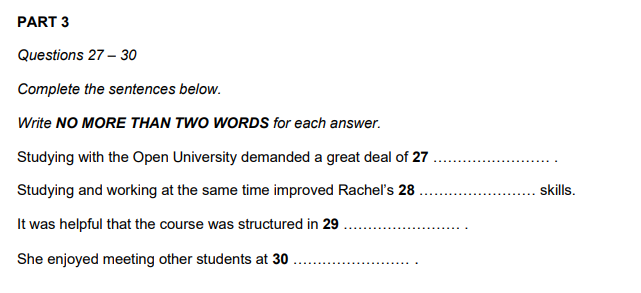

This is an explaination of all schemas and models.

In ielts exam there are a limited types of questions that can be asked. for eg:
- Listening
  - Multiple Choice Questions ( Type 1 and 2 )
  - Matching ( Matching List and Matching Info )
  - Diagram Labelling
  - Plan/Map Labelling
  - Sentence Completion
  - Note Completion
  - Flow Chat Completion
  - Table Completion
  - Summary Completion
  - Form Completion


- Reading
  - Multiple Choice Questions ( Type 1 and 2 )
  - True/False/Not Given
  - Yes/No/Not Given
  - Matching ( Matching List and Matching Info )
  - Sentence Completion
  - Note Completion
  - Flow Chat Completion
  - Table Completion
  - Diagram Labelling
  - Summary Completion
  - Short Answer Questions


Listening schema explainations:

1. Matching : 
   1. Type 1 example:

        

        for this the json will be :
        ```const q = {
            startQuestionNum : 21,
            endQuestionNum : 25,
            questionHeader : 'Write the correct letter, A, B or C next to question 21-25.\nYou may choose any letter more than once.',
            questionOptionRepeatable : true,
            questionStatment : 'What does Jack tell his tutor about each of the following course option?',
            questionOptions : ['
            A He'll definitely do it.', 
            'B He may or may not do it.',
            'C He won't do it.'],
            numStatements : [
                '21 Media Studies _BLANK_',
                '22 Women and Power _BLANK_',
                '23 Culture and Society _BLANK_',
                '24 Identify and Popular Culture _BLANK_',
                '25 Introduction to Culture Theory _BLANK_',
            ],
        }
        ```
   2. Type 2 example:

        

        for this the json will be:
        ```
        const q = {
            startQuestionNum: 1,
            endQuestionNum: 4,
            questionHeader: 'Choose your answers from the box and write the correct letter A-E next to questions 1-4.',
            questionOptionRepeatable: false,
            questionStatment: 'Which hotel matches each description?',
            questionOptions: [
                'A The Bridge Hotel',
                'B Carlton House',
                'C The Imperial',
                'D The Majestic',
                'E The Royal Oak'
            ],
            numStatements: [
                '1 is in a rural area _BLANK_',
                '2 only opened recently _BLANK_',
                '3 offers facilities for business functions _BLANK_',
                '4 has an indoor swimming pool _BLANK_',
            ]
        }
        ``` 


2. Sentence Completion: 
    
    example 1:

   

    for this json will be:
    ```
    const q = {
        startQuestionNum: 9,
        endQuestionNum: 10,
        numOfWords: 3,
        numOfNum: 0,
        questionHeader: 'Write NO MORE THAN THREE WORDS to complete each space.' ,
        numStatements: [
            '9 Samuel's aunt plans to travel to his apartment on _BLANK_.',
            '10 The journey time is approximately _BLANK_.'
        ] 
    }
    ```

    example 2:

    

    for this json will be:
    ```
    const q = {
        startQuestionNum: 7,
        endQuestionNum: 9,
        numOfWords: 1,
        numOfNum: 0,
        questionHeader: 'Complete the sentences below.\nWrite ONE WORD ONLY for each answer.\n\tPaxton Nature Reserve' ,
        numStatements: [
            '7 Paxton is a good place for seeing rare _BLANK_ all year round.',
            '9 This is a particularly good time for seeing certain unusual _BLANK_.',
            '9 Visitors will be able to learn about _BLANK_ and then collect some.',
            '10 Part of the _BLANK_ has been made suitable for swimming.'
        ] 
    }
    ```

    `numOfNum` property is for cases like this: 

    

    so json will be:
    ```
    const q = {
        ...
        numOfWords: 1,
        numOfNum: 1,
        ...
    }
    ```


Will keep adding as the schemas are finalised

Reading Schema explainations:

1. Matching:
   1. Matching Info Type:

        

        for this the json will be:
        ```
        const q = {
            startQuestionNum: 1,
            endQuestionNum: 3,
            qTypeMatchingInfo : true,
            questionHeader : 'Reading Passage 1 has nine paragraphs, A-I.\nWrite the correct letter, A-I, in boxes 1-3 on your answer sheet.',
            numStatements : [
                '1 a reference to characteristics that only apply to food production.',
                '2 a reference to challenges face only farmers in certain parts of the world.',
                '3 a reference to difficulties in bringing about co-operation between farmers'
            ]
        }
        ```
   2. Matching List Type:

        

        for this the json will be:
        ```
        const q = {
            startQuestionNum : 1,
            endQuestionNum : 5,
            qTypeList : true,
            questionHeader : 'Sample Passage 6 has six sections, A-F.\nChoose the correct heading for section A-D and F from the list of heading below.',
            questionTitle: 'List of Headings',
            questionTitle: 'List of Headings',
            questionStatements: [
                'i. The probable effects of the new international trade agreement',
                'ii. The environmental impact of modern farming',
                'iii. Farming and soil erosion',
                'iv. The effects of government policy in poor countries.',
                'v Governments and management of environment',
                'vi The effects of government policy in rich countries',
                'vii Farming and food output',
                'viii The effects of government policy on food output;,
                'ix The new prospects for world trade'
                ],
                numStatements: [
                    '1 Section A',
                    '2 Section B',
                    '3 Section C',
                    '4 Section D',
                    '5 Section F'
                ],
        }
        ```
2. Sentence Completion: 
   The schema and model for the sentence completion is same for reading and listening.


Will keep adding as the schemas are finalised